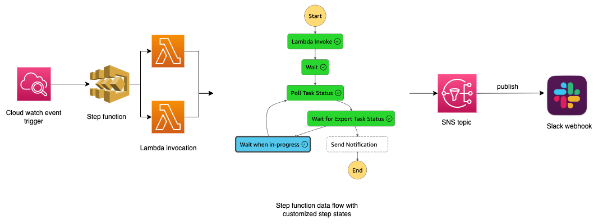

# export-s3-rds-backup
Complete automation to trigger export-to-s3 RDS Instance backup, stores it in s3 bucket for compliance policies that require snapshots to be stored more than 30 days and sends notification on completion to your slack channel

## Architectural Flow

## Requirements

Ensure that you have your RDS instance available
Have automated backup enabled
Make sure to have slack webhook url saved in secrets manager in AWS example: `https://hooks.slack.com/services/TJIWSGRGBO/JNFWEBGWURGBERUGBSD12` without quotations

## Providers

| Name | Version |
|------|---------|
|  [archive](#provider\_archive) | n/a |
|  [aws](#provider\_aws) | n/a |

## Modules

| Name | Source | Version |
|------|--------|---------|
|  [backup\_rds\_snapshot](#module\_backup\_rds\_snapshot) | terraform-aws-modules/s3-bucket/aws | ~> 3.0 |
|  [lambda\_function](#module\_lambda\_function) | terraform-aws-modules/lambda/aws | ~> 4.0 |
|  [notify\_lambda\_function](#module\_notify\_lambda\_function) | terraform-aws-modules/lambda/aws | ~> 4.0 |

## Resources

| Name | Type |
|------|------|
| [aws_cloudwatch_event_rule.backup_trigger](https://registry.terraform.io/providers/hashicorp/aws/latest/docs/resources/cloudwatch_event_rule) | resource |
| [aws_cloudwatch_event_target.step_function_target](https://registry.terraform.io/providers/hashicorp/aws/latest/docs/resources/cloudwatch_event_target) | resource |
| [aws_iam_policy.lambda_access_to_rds](https://registry.terraform.io/providers/hashicorp/aws/latest/docs/resources/iam_policy) | resource |
| [aws_iam_policy.lambda_access_to_sns](https://registry.terraform.io/providers/hashicorp/aws/latest/docs/resources/iam_policy) | resource |
| [aws_iam_policy.rds_s3_access](https://registry.terraform.io/providers/hashicorp/aws/latest/docs/resources/iam_policy) | resource |
| [aws_iam_policy.step_function_access_to_lambda](https://registry.terraform.io/providers/hashicorp/aws/latest/docs/resources/iam_policy) | resource |
| [aws_iam_role.lambda_rds_export_access](https://registry.terraform.io/providers/hashicorp/aws/latest/docs/resources/iam_role) | resource |
| [aws_iam_role.rds_s3_access](https://registry.terraform.io/providers/hashicorp/aws/latest/docs/resources/iam_role) | resource |
| [aws_iam_role.step_function_access_to_lambda](https://registry.terraform.io/providers/hashicorp/aws/latest/docs/resources/iam_role) | resource |
| [aws_iam_role_policy_attachment.lambda_rds_export_access](https://registry.terraform.io/providers/hashicorp/aws/latest/docs/resources/iam_role_policy_attachment) | resource |
| [aws_iam_role_policy_attachment.lambda_rds_sns_access](https://registry.terraform.io/providers/hashicorp/aws/latest/docs/resources/iam_role_policy_attachment) | resource |
| [aws_iam_role_policy_attachment.rds_s3_access](https://registry.terraform.io/providers/hashicorp/aws/latest/docs/resources/iam_role_policy_attachment) | resource |
| [aws_iam_role_policy_attachment.step_function_access_to_lambda](https://registry.terraform.io/providers/hashicorp/aws/latest/docs/resources/iam_role_policy_attachment) | resource |
| [aws_kms_key.s3_lambda_encryption](https://registry.terraform.io/providers/hashicorp/aws/latest/docs/resources/kms_key) | resource |
| [aws_s3_bucket_object_lock_configuration.rds_backup_retention](https://registry.terraform.io/providers/hashicorp/aws/latest/docs/resources/s3_bucket_object_lock_configuration) | resource |
| [aws_sfn_state_machine.rds_backup_notify_trigger](https://registry.terraform.io/providers/hashicorp/aws/latest/docs/resources/sfn_state_machine) | resource |
| [aws_sns_topic.rds_backup_notify](https://registry.terraform.io/providers/hashicorp/aws/latest/docs/resources/sns_topic) | resource |
| [archive_file.lambda_function](https://registry.terraform.io/providers/hashicorp/archive/latest/docs/data-sources/file) | data source |
| [archive_file.notify_lambda_function](https://registry.terraform.io/providers/hashicorp/archive/latest/docs/data-sources/file) | data source |
| [aws_iam_policy_document.lambda_access_to_rds](https://registry.terraform.io/providers/hashicorp/aws/latest/docs/data-sources/iam_policy_document) | data source |
| [aws_iam_policy_document.lambda_access_to_sns](https://registry.terraform.io/providers/hashicorp/aws/latest/docs/data-sources/iam_policy_document) | data source |
| [aws_iam_policy_document.rds_s3_access](https://registry.terraform.io/providers/hashicorp/aws/latest/docs/data-sources/iam_policy_document) | data source |
| [aws_iam_policy_document.s3_lambda_encryption](https://registry.terraform.io/providers/hashicorp/aws/latest/docs/data-sources/iam_policy_document) | data source |
| [aws_iam_policy_document.step_function_access_to_lambda](https://registry.terraform.io/providers/hashicorp/aws/latest/docs/data-sources/iam_policy_document) | data source |
| [aws_secretsmanager_secret.slack_webhook_url](https://registry.terraform.io/providers/hashicorp/aws/latest/docs/data-sources/secretsmanager_secret) | data source |
| [aws_secretsmanager_secret_version.slack_webhook_secret_version](https://registry.terraform.io/providers/hashicorp/aws/latest/docs/data-sources/secretsmanager_secret_version) | data source |

## Inputs

| Name | Description | Type | Default | Required |
|------|-------------|------|---------|:--------:|
|  [account\_number](#input\_account\_number) | account number where the db instance exists and where the resources needs to be created | `string` | n/a | yes |
|  [common\_tags](#input\_common\_tags) | tags to attach to resources | `map(any)` | n/a | yes |
|  [db\_instance\_id](#input\_db\_instance\_id) | DB instance identifier in the account above for which backup needs to be enabled | `string` | n/a | yes |
|  [project](#input\_project) | Unique project name identifier for which the backup module needs to be triggered | `string` | n/a | yes |

## Outputs

| Name | Description |
|------|-------------|
|  [lambda\_rds\_export\_access\_role](#output\_lambda\_rds\_export\_access\_role) | n/a |
|  [rds\_s3\_access\_role](#output\_rds\_s3\_access\_role) | Output variables needed, which is passed to postgres rds creation module where kms key iam policy is defined Lambda backup roles need permission to access data encrypted in rds to take backup |
